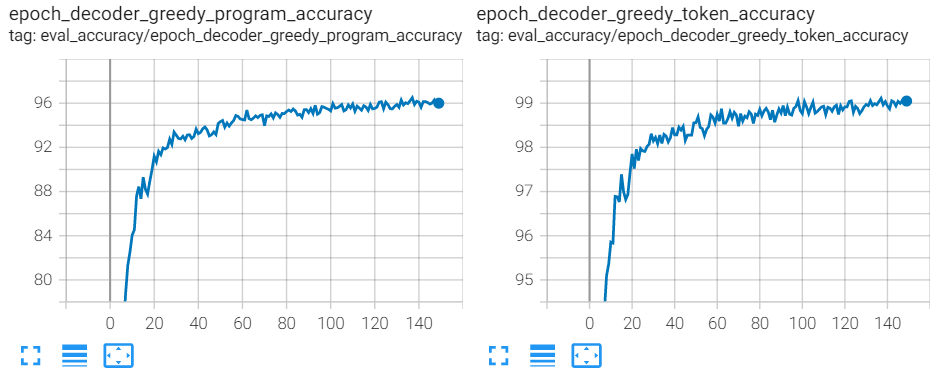
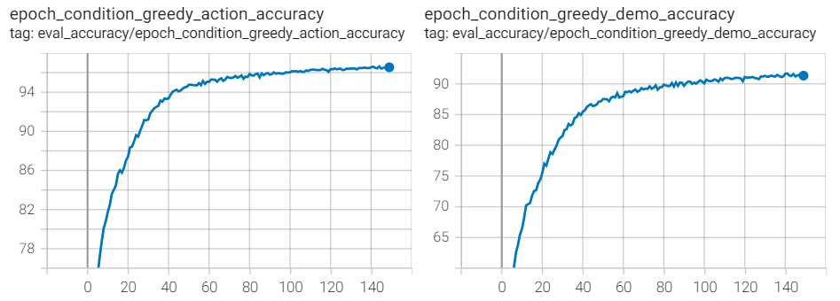

# Learning to Synthesize Programs as Interpretable and Generalizable Policies

This project is an implementation of [**Learning to Synthesize Programs as Interpretable and Generalizable Policies**](https://arxiv.org/abs/2108.13643), which is published in [**NeurIPS 2021**](https://neurips.cc/Conferences/2021/). Please visit our [project page](https://clvrai.com/leaps/) for more information.

Neural network policies produced with DRL methods are not human-interpretable and often have difficulty generalizing to novel scenarios. To address these issues, we explore learning structured, programmatic policies. In our framework we learn to synthesize programs solely from reward signals. However, programs are difficult to synthesize purely from environment reward. To this end, we propose a framework Learning Embeddings for lAtent Program Synthesis (LEAPS), which first learns a program embedding space that continuously parameterizes diverse behaviors in an unsupervised manner and then search over the learned program embedding space to yield a program that maximizes the return for a given task.

<p align="center">
    
</p>

We evaluate our model on a set of sparse-reward Karel environments---commonly used in the program synthesis domain---specially designed to evaluate the performance differences between our program policies and DRL baselines.

## Environments

### Karel environment
- You can find the codes for the Karel environments in [this directory](./karel_env)

## Getting Started

- [Python 3.6](https://www.python.org/downloads/release/python-360/)
- [PyTorch 1.4.0](https://pytorch.org/get-started/previous-versions/#v140)
- Install `virtualenv`, create a virtual environment, activate it and install the requirements in [`requirements.txt`](requirements.txt).

```
pip3 install --upgrade virtualenv
virtualenv prl
source prl/bin/activate
pip3 install -r requirements.txt
```


## Usage

### LEAPS Training

### Stage 1: Learning program embeddings

    - Download dataset from [here](https://drive.google.com/drive/folders/1CM4_1zBAXgztPX6n_D6HmavYujZSfdV4?usp=sharing)

```bash
CUDA_VISIBLE_DEVICES="0" python3 pretrain/trainer.py -c pretrain/cfg.py -d data/karel_dataset/ --verbose --train.batch_size 256 --num_lstm_cell_units 256 --loss.latent_loss_coef 0.1 --rl.loss.latent_rl_loss_coef 0.1 --device cuda:0 --algorithm supervisedRL --optimizer.params.lr 1e-3 --prefix LEAPS
```

- Selected arguments (see the `pretrain/cfg.py` for more details)
    - --configfile/-c: Input file for parameters, constants and initial settings
    - --datadir/-d: dataset directory containing data.hdf5 and id.txt
    - --outdir/-o: Output directory for results
    - --algorithm: supervised, supervisedRL
    - Hyperparameters
        - --train.batch_size: number of programs in one batch during training
        - --num_lstm_cell_units: latent space vector size, rnn hidden layer size
        - --rl.loss.decoder_rl_loss_coef (L<sup>R</sup>): program behavior reconstruction loss
        - --loss.condition_loss_coef (L<sup>L</sup>): latent behavior reconstruction loss
        
- Stage 1 ablations

| Ablation    | Command |
| :--------:  | ---------------------------------------- |
| **LEAPS**   | ```python3 pretrain/trainer.py -c pretrain/cfg.py -d data/karel_dataset/ --verbose --train.batch_size 256 --num_lstm_cell_units 256 --loss.latent_loss_coef 0.1 --rl.loss.latent_rl_loss_coef 0.1 --device cuda:0 --algorithm supervisedRL --optimizer.params.lr 1e-3 --prefix LEAPS``` |
| **LEAPSP**  | ```python3 pretrain/trainer.py -c pretrain/cfg.py -d data/karel_dataset/ --verbose --train.batch_size 256 --device cuda:0 --num_lstm_cell_units 256 --loss.latent_loss_coef 0.1 --loss.condition_loss_coef 0.0 --net.condition.observations initial_state --optimizer.params.lr 1e-3 --prefix LEAPSP``` |
| **LEAPSPR** | ```python3 pretrain/trainer.py -c pretrain/cfg.py -d data/karel_dataset/ --verbose --train.batch_size 256 --num_lstm_cell_units 256 --loss.latent_loss_coef 0.1 --rl.loss.latent_rl_loss_coef 0.1 --device cuda:0 --algorithm supervisedRL --net.condition.freeze_params True --loss.condition_loss_coef 0.0 --optimizer.params.lr 1e-3 --net.condition.observations initial_state --prefix LEAPSPR``` |
| **LEAPSPL** | ```python3 pretrain/trainer.py -c pretrain/cfg.py -d data/karel_dataset/ --verbose --train.batch_size 256 --device cuda:0 --num_lstm_cell_units 256 --loss.latent_loss_coef 0.1 --optimizer.params.lr 1e-3 --prefix LEAPSPL``` |


### Stage 2: CEM search
```bash
python3 pretrain/trainer.py --configfile pretrain/cfg.py --datadir placeholder --num_lstm_cell_units 256 --algorithm CEM --net.saved_params_path weights/LEAPS/best_valid_params.ptp --save_interval 10  --rl.envs.executable.task_file tasks/test2.txt --env_task program --rl.envs.executable.task_definition program --CEM.reduction weighted_mean --CEM.population_size 8 --CEM.sigma 0.1 --CEM.exponential_reward False --reward_type dense_subsequence_match --CEM.average_score_for_solving 1.1 --CEM.use_exp_sig_decay False --CEM.elitism_rate 0.05 --max_program_len 45 --dsl.max_program_len 45  --prefix CEM --seed 12  --CEM.init_type ones
```

- Selected arguments (see the `pretrain/cfg.py` for more details)
    - --algorithm: CEM, RandSearch
    - Checkpoints: specify the path to a pre-trained checkpoint
        - --net.saved_params_path: load pre-trained parameters (e.g. `weights/LEAPS/best_valid_params.ptp`).
    - Logging:            
        - --save_interval: Save weights at every ith interval (None, int)
    - Task definition:
        - --rl.envs.executable.task_file: path to text file containing program string (e.g. tasks/test1.txt)
        - --env_task: environment task MDP
        - --rl.envs.executable.task_definition: task is defined by either a program or reward function
    - CEM Hyperparameters:
        - --CEM.population_size: number of programs in one CEM batch
        - --CEM.sigma: CEM sample standard deviation 
        - --CEM.use_exp_sig_decay: boolean variable to indicate exponential decay in sigma
        - --CEM.elitism_rate: percent of the population considered ‘elites’
        - --CEM.reduction: CEM population reduction ['mean', 'weighted_mean']
        - --CEM.init_type: initial distribution to sample from ['normal':N(0,1), 'tiny_normal':N(0,0.1), 'ones':N(1, 0)]
        
## Results

### Stage 1: Learning program embeddings

<p align="center">
    
</p>

<p align="center">
    
</p>

### Stage 2: CEM search
- LEAPS performance on different tasks over 5 seeds
    - Program behavior reconstruction tasks 

    | Task      | Mean Reward |
    | :-------: | ----------- |
    | test1.txt |   1.06      |
    | test2.txt |   0.87      |
    | test3.txt |   0.85      |
    | test4.txt |   0.57      |
    
    - Karel environment tasks

    | Task         | Mean Reward |
    | :----------: | ----------- |
    | STAIRCLIMBER |   1.00      |
    | FOURCORNER   |   0.45      |
    | TOPOFF       |   0.81      |
    | MAZE         |   1.00      |
    | CLEANHOUSE   |   0.18      |
    | HARVESTER    |   0.45      |


## Cite the paper

If you find this useful, please cite

```
@inproceedings{
trivedi2021learning,
title={Learning to Synthesize Programs as Interpretable and Generalizable Policies},
author={Dweep Trivedi and Jesse Zhang and Shao-Hua Sun and Joseph J Lim},
booktitle={Thirty-Fifth Conference on Neural Information Processing Systems},
year={2021},
url={https://openreview.net/forum?id=wP9twkexC3V}
}
```

## Authors

[Dweep Trivedi](https://dweeptrivedi.github.io/), [Jesse Zhang](https://jesbu1.github.io/), [Shao-Hua Sun](https://shaohua0116.github.io/)
