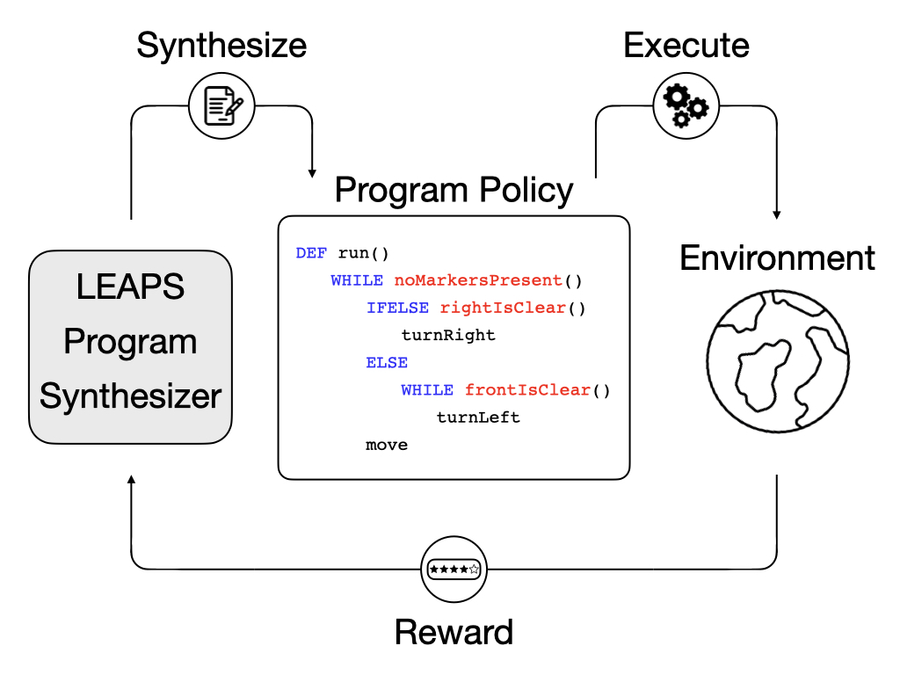

# Learning to Synthesize Programs as Interpretable and Generalizable Policies

This repository is the official implementation of [LEAPS](https://arxiv.org/abs/2108.13643), published as a conference paper in NeurIPS 2021. 



## Method Overview:
To address the interpretability and generalization issues of deep reinforcement learning (DRL) methods, we propose synthesizing programs from reward. These programs are human-readable, flexible, and expressive. However, programs are difficult to synthesize purely from environment reward.

Due to the difficulty of directly synthesizing discrete program tokens only from task reward, we break down the problem into two stages:

1. **Learning program embedding stage**: we first learn a smooth, latent program embedding space based on a dataset of randomly generated programs.
2. **Latent program search stage**: we use the Cross Entropy Method to search for the best candidate latent programs that can be decoded and eecuted to maximize the reward to solve given tasks.

For more details, please see our [website](https://clvrai.com/leaps) or [paper](https://arxiv.org/abs/2108.13643).

To cite our paper, please use the following Bibtex entry:
```    
@inproceedings{trivedi2021leaps,
        author={Dweep Trivedi and Jesse Zhang and Shao-Hua Sun and Joseph J. Lim},
        booktitle = {Advances in Neural Information Processing Systems},
        title={Learning to Synthesize Programs as Interpretable and Generalizable Policies}, 
        url = {https://arxiv.org/pdf/2108.13643.pdf},
        volume = {34},
        year = {2021}
    }
```


# Code coming soon!


## Requirements

To install requirements:

```setup
pip install -r requirements.txt
```

>📋  Describe how to set up the environment, e.g. pip/conda/docker commands, download datasets, etc...

## Training

To train the model(s) in the paper, run this command:

```train
python train.py --input-data <path_to_data> --alpha 10 --beta 20
```

>📋  Describe how to train the models, with example commands on how to train the models in your paper, including the full training procedure and appropriate hyperparameters.

## Evaluation

To evaluate my model on ImageNet, run:

```eval
python eval.py --model-file mymodel.pth --benchmark imagenet
```

>📋  Describe how to evaluate the trained models on benchmarks reported in the paper, give commands that produce the results (section below).

## Pre-trained Models

You can download pretrained models here:

- [My awesome model](https://drive.google.com/mymodel.pth) trained on ImageNet using parameters x,y,z. 

>📋  Give a link to where/how the pretrained models can be downloaded and how they were trained (if applicable).  Alternatively you can have an additional column in your results table with a link to the models.

## Results

Our model achieves the following performance on :

### [Image Classification on ImageNet](https://paperswithcode.com/sota/image-classification-on-imagenet)

| Model name         | Top 1 Accuracy  | Top 5 Accuracy |
| ------------------ |---------------- | -------------- |
| My awesome model   |     85%         |      95%       |

>📋  Include a table of results from your paper, and link back to the leaderboard for clarity and context. If your main result is a figure, include that figure and link to the command or notebook to reproduce it. 


## Contributing

>📋  Pick a licence and describe how to contribute to your code repository. 
